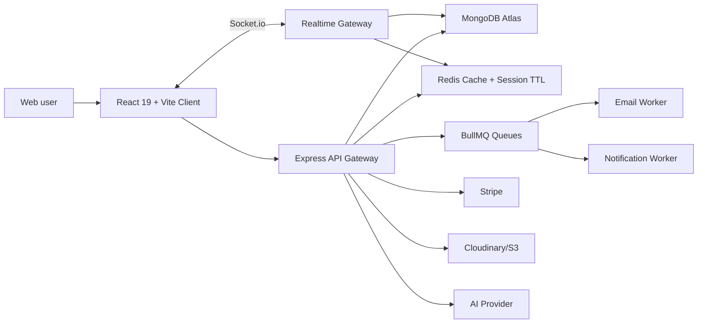
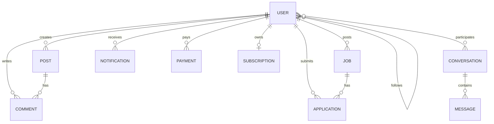
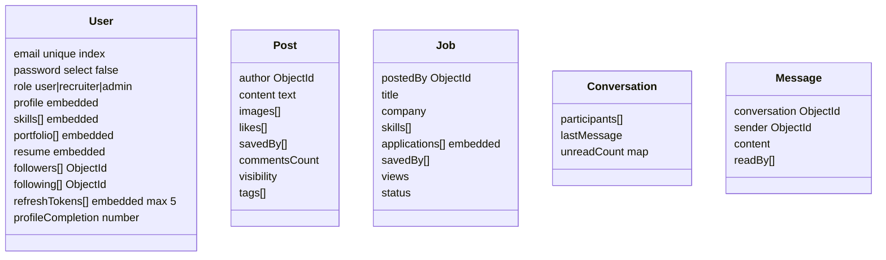

# SkillSphere AI System Design

## High-Level Design



The application uses a feature-based monorepo. The server exposes REST APIs for core workflows and Socket.io for chat, presence, typing indicators, read receipts, and live notifications. Redis is used for ephemeral auth tokens, cache/session storage, and queue infrastructure. MongoDB stores durable product data.

## Low-Level Backend Design

Each backend feature follows the same production-friendly flow:

```txt
route -> validation middleware -> controller -> service -> repository -> mongoose model
```

- Routes keep HTTP paths readable.
- Zod validators reject invalid input before business logic.
- Controllers stay thin and only translate HTTP to service calls.
- Services own transactions, authorization rules, queue fan-out, and external APIs.
- Repositories isolate Mongoose query details and make service tests easier.
- Shared middleware handles auth, RBAC, rate limiting, sanitization, and errors.

## ER Diagram



## Database Schema Diagram



## MongoDB Decisions

- `refreshTokens` are embedded in `User` because login/session reads are hot-path and bounded to five active devices.
- `skills`, `portfolio`, and `resume` are embedded because they are profile-owned and usually loaded together.
- `followers` and `following` are ObjectId arrays for a portfolio product. At very large scale, move to an edge collection to avoid oversized user documents.
- `applications` are embedded in `Job` because recruiters usually review applications in the context of one job. At high volume, split to an `applications` collection.
- Text indexes support user/post/job search. Compound indexes support admin filters and recruiter dashboards.
- Aggregation pipelines are used for platform stats, job recommendations, and dashboard metrics.

## Core Feature Notes

Authentication:
Used in production to protect user data and reduce account takeover risk. Refresh token rotation detects stolen token reuse. Tradeoff: storing refresh tokens in MongoDB adds a DB write per login/refresh, but enables per-device revocation.

User management:
Profile completion, skills, resume, portfolio, follow graph, search, and recommendations model a realistic professional network. Scaling concern: follower arrays should become a separate collection if users can reach hundreds of thousands of edges.

Social feed:
Posts, likes, comments, saves, shares, trending, and pagination mirror LinkedIn-style systems. Scaling concern: start with query-time fan-out; move to fan-out-on-write feeds for very high traffic.

Real-time:
Socket.io powers chat, typing, online status, read receipts, and notifications. In production, use Redis adapter across multiple server instances.

AI:
AI profile summaries, resume analysis, skill recommendations, job matching, and post generation are isolated behind `features/ai`. This keeps provider-specific prompts and fallbacks out of core product logic.

Jobs:
Recruiters post jobs and manage applications; candidates save/apply/track. MongoDB aggregation can compute skill overlap for recommendations.

Payments:
Stripe checkout and webhooks handle premium membership. The app also has simulation mode for portfolio demos without a live Stripe key.

Admin:
Admin dashboards use aggregation, moderation lists, user status control, and subscription metrics. This demonstrates operational tooling beyond CRUD.

## React Performance Optimizations

- Route-level lazy loading for non-critical pages.
- RTK Query caches API responses and invalidates by entity tags.
- Stable component boundaries keep dashboard panels cheap to re-render.
- Feed and jobs screens are structured for infinite scroll and cursor pagination.
- Socket connection is centralized in a custom hook instead of duplicated per component.
- Tailwind utility classes avoid runtime CSS-in-JS overhead.

## Interview Questions

- Why use refresh token rotation instead of only long-lived access tokens?
- How would you detect refresh token reuse and revoke sessions?
- Where should RBAC live: frontend, backend, or both?
- Why embed job applications in a job document, and when would you normalize them?
- How do indexes affect MongoDB write and read performance?
- How would you scale Socket.io horizontally?
- Why use BullMQ for email and notifications?
- How does RTK Query prevent duplicate API calls and stale UI?
- What is the difference between cache invalidation and cache expiration?
- How would you process Stripe webhooks idempotently?

## Deployment

- Frontend: Vercel
- Backend: Render or Railway
- Database: MongoDB Atlas
- Redis: Upstash, Railway Redis, or Render Redis
- Storage: Cloudinary for images/resumes, optional S3 adapter
- CI/CD: GitHub Actions build checks for client and server

## Phase Roadmap

1. Authentication and user management
2. Social feed and posts
3. Real-time chat and notifications
4. Job marketplace
5. Payments and subscriptions
6. AI features
7. Admin dashboard
8. Docker, CI/CD, deployment, monitoring
